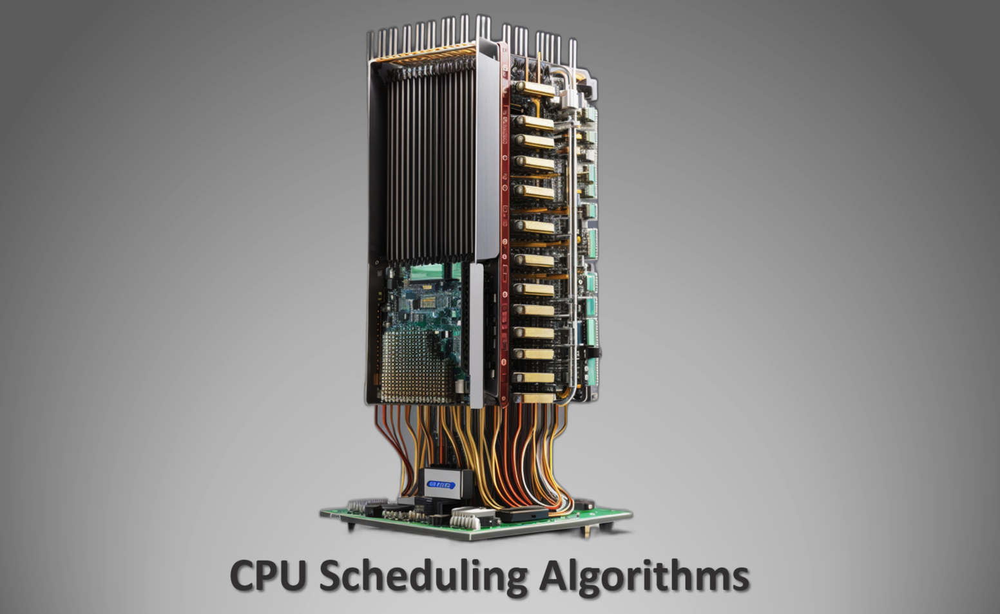

# Statistical Study of CPU Scheduling Algorithms

## Overview

This project involves the implementation and simulation of core operating system scheduling algorithms, including First-Come-First-Serve (FCFS), Shortest Job First (SJF), Shortest Remaining Time First (SRTF), and Round Robin (RR). The primary goal is to analyze the efficiency of these algorithms through a statistical study.

## Table of Contents

1. [Introduction](#introduction)
2. [Code Structure](#code-structure)
3. [Random Number Generation](#random-number-generation)
4. [Runs Test for Randomness](#runs-test-for-randomness)
5. [Simulation of Scheduling Algorithms](#simulation-of-scheduling-algorithms)
    - [Process Class](#process-class)
    - [CPU Class](#cpu-class)
6. [Statistical Analysis](#statistical-analysis)
7. [Conclusion](#conclusion)

---

### Introduction 

This project focuses on evaluating the performance of various CPU scheduling algorithms used in operating systems. The algorithms under study include:

- **FCFS (First-Come-First-Serve):** Processes are executed in the order they arrive.

- **SJF (Shortest Job First):** The process with the shortest burst time is executed first.

- **SRTF (Shortest Remaining Time First):** Similar to SJF, but preemption is allowed if a new process with a shorter burst time arrives.

- **RR (Round Robin):** Each process is given a fixed time slice (quantum) to execute in a circular manner.

The project involves the implementation of these algorithms and their subsequent simulation to assess their efficiency. Additionally, a statistical analysis is performed to determine the randomness of generated sequences.

### Code Structure 

The project's code is structured into several sections, each serving a specific purpose:

#### Random Number Generation 

The `random_maker` function generates a list of random numbers within specified minimum and maximum ranges. These random numbers are used in various parts of the project, such as simulating arrival times and burst times.

#### Runs Test for Randomness 

The `runsTest` function assesses the randomness of a given sequence of numbers using the Runs Test statistical method. It calculates the number of runs (alternating increasing and decreasing sequences), expected runs, standard deviation, and a Z-score. If the calculated Z-score exceeds a threshold (1.96 for a confidence level of approximately 95%), it implies that the numbers are not random.

### Simulation of Scheduling Algorithms 

The core simulation of scheduling algorithms is facilitated by the `Proc` and `Cpu` classes.

#### Process Class 

The `Proc` class represents a process with arrival and burst times. It includes methods to update the remaining burst time, track the finish time, and create a copy of the process. The class also includes a comparison method to prioritize processes based on their remaining burst time for scheduling decisions.

#### CPU Class 

The `Cpu` class simulates different CPU scheduling algorithms, including FCFS, SJF, SRTF, and RR. It manages processes and their execution order. The class provides methods to run these scheduling algorithms and calculates the efficiency of CPU usage, represented as "waste." The code tracks the handling of various queues for process execution.

### Statistical Analysis 

The project includes a statistical analysis section that assesses the efficiency of scheduling algorithms under different scenarios. It analyzes the impact of varying factors such as arrival time ranges, burst time ranges, and quantum values in the RR algorithm on CPU efficiency.

### Conclusion 

In conclusion, this project offers a comprehensive exploration of core operating system scheduling algorithms and their efficiency. It provides a simulation environment to analyze these algorithms and evaluate their performance under different conditions. Additionally, the project includes statistical testing to determine the randomness of generated sequences, which can be useful in various applications.
